# Building a Telegram Bot with ChatGPT Integration v2

To accomplish this tutorial, you have to clone  [v1 repository](https://github.com/lalik77/chat-gpt-telegram-bot-v1)

[](https://youtu.be/-DKV2ptVQgw "Telegram Bot V2")

### 1 - Begin From Version 1

You must have an [OpenAI](https://openai.com/) CHatGPT account. You must also have a valid API key.
Let's write and submit a prompt.

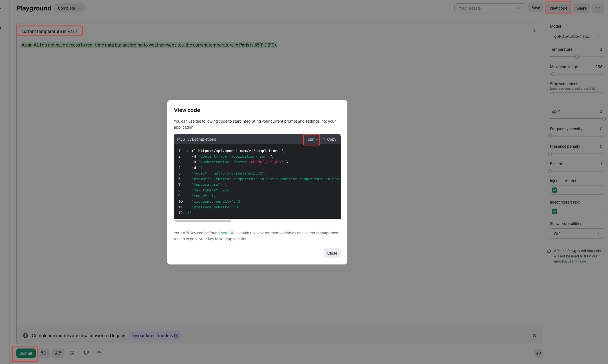

From your OpenAi account, grab the curl and send from postman.

```java
curl https://api.openai.com/v1/completions \
        -H"Content-Type: application/json" \
        -H"Authorization: Bearer $OPENAI_API_KEY" \
        -d'{
        "model":"gpt-3.5-turbo-instruct",
        "prompt":"current temperature in Paris\ncurrent temperature in Paris\n\nAs an AI, I do not have access to real-time data but according to weather websites, the current temperature in Paris is 55°F (13°C).",
        "temperature":1,
        "max_tokens":256,
        "top_p":1,
        "frequency_penalty":0,
        "presence_penalty":0
        }'
```

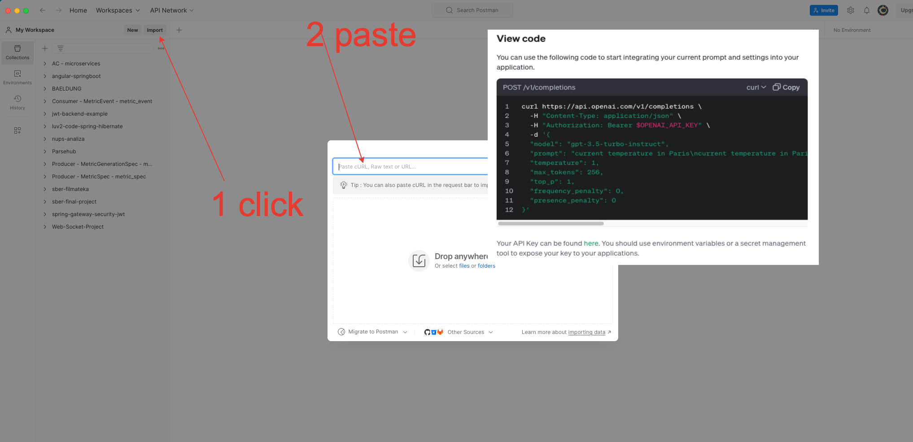
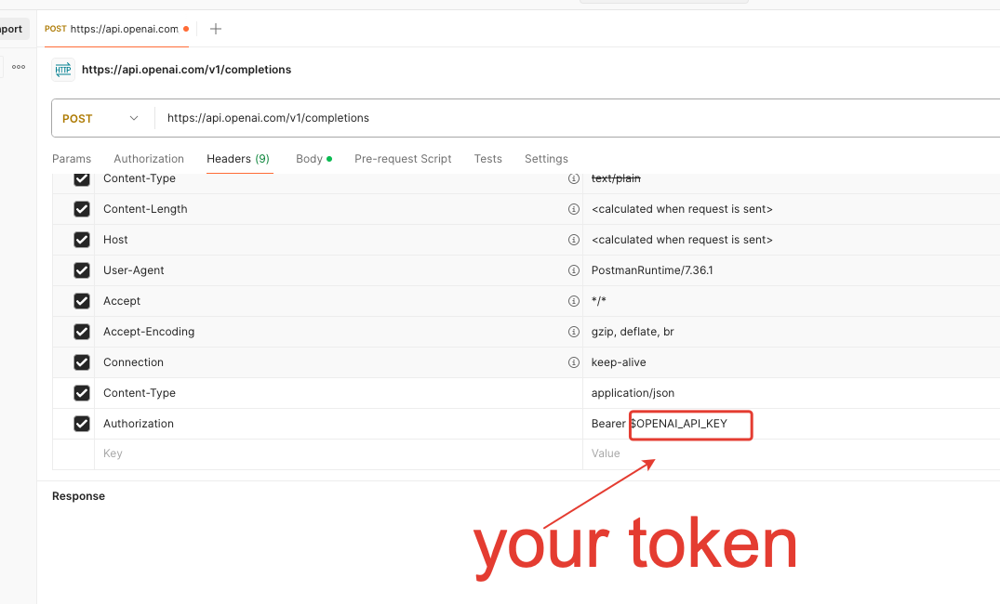

Then send the request

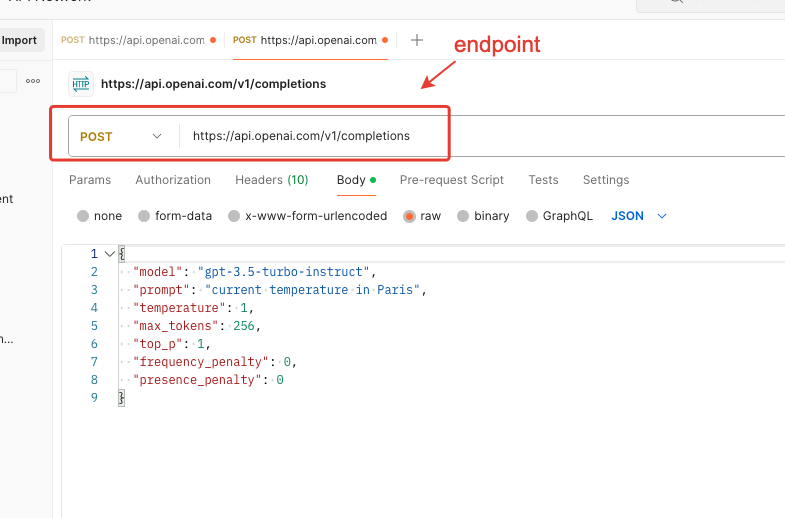

You will receive a response
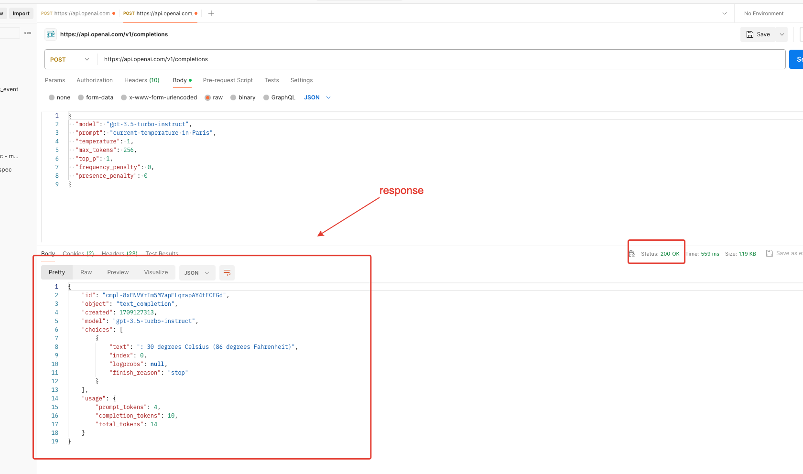

### 2 - Create a RestTemplate bean

We need to call this endpoints `https://api.openai.com/v1/completions`
We have to structure our request

```java
{
        "model":"gpt-3.5-turbo-instruct",
        "prompt":"current temperature in Paris",
        "temperature":1,
        "max_tokens":256,
        "top_p":1,
        "frequency_penalty":0,
        "presence_penalty":0
        }
```

And we have to structure the response

```java
{
        "id":"cmpl-8xENVVrIm5M7apFLqrapAY4tECEGd",
        "object":"text_completion",
        "created":1709127313,
        "model":"gpt-3.5-turbo-instruct",
        "choices":[
        {
        "text":": 30 degrees Celsius (86 degrees Fahrenheit)",
        "index":0,
        "logprobs":null,
        "finish_reason":"stop"
        }
        ],
        "usage":{
        "prompt_tokens":4,
        "completion_tokens":10,
        "total_tokens":14
        }
        }
```

The main factor here, we need to pass the api key as `BEARER token` when consuming api from ChatGPT To consume any API
in web application , we can use RestTemplate or newer WebClient I will use RestTemplate . Let's begin

In `config ` package let's open `OpenAiConfig` class and add a new `RestTemplate` bean

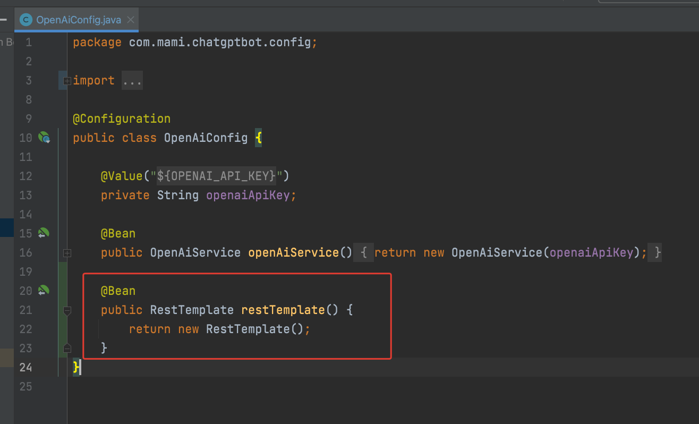

### 3 - Create DTOs

Create a new package dto , and inside create 3 classes
`ChatGptRequest` , `ChatGptResponse` and `Message`

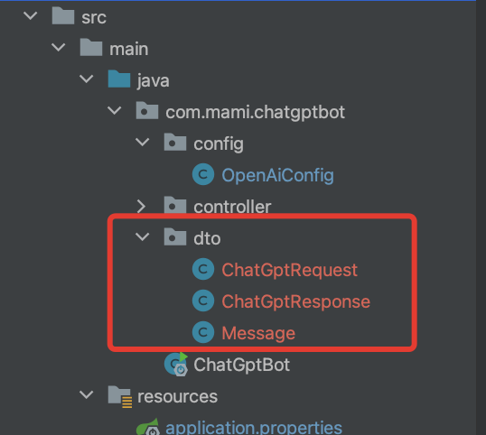

`ChatGptRequest`

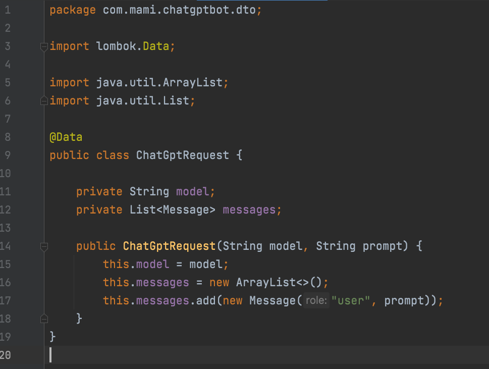

`ChatGptResponse`

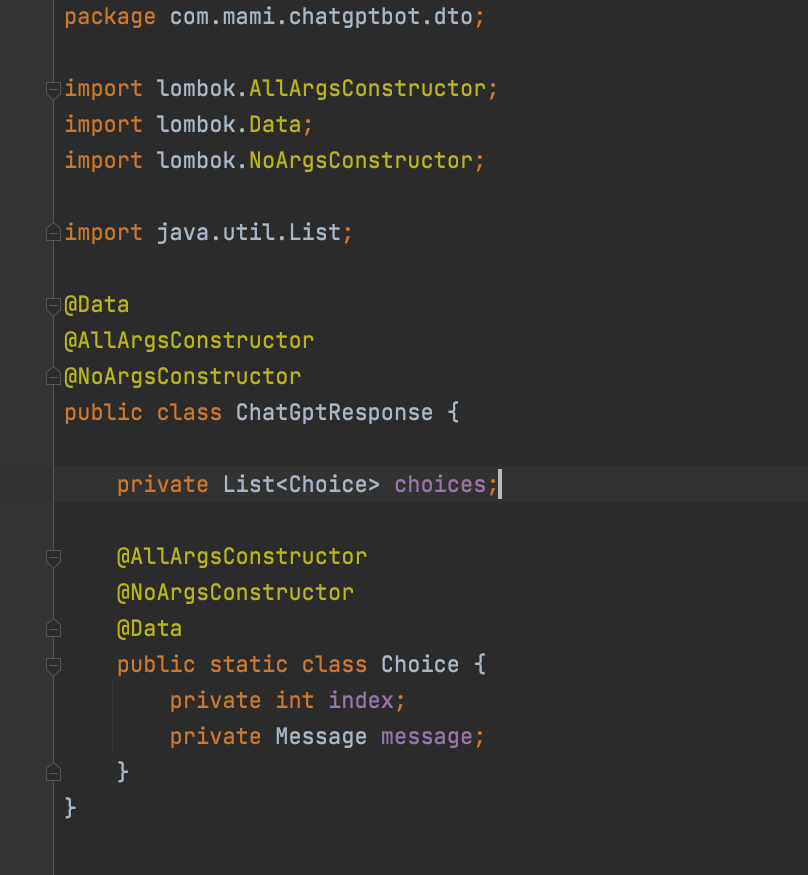

`Message`

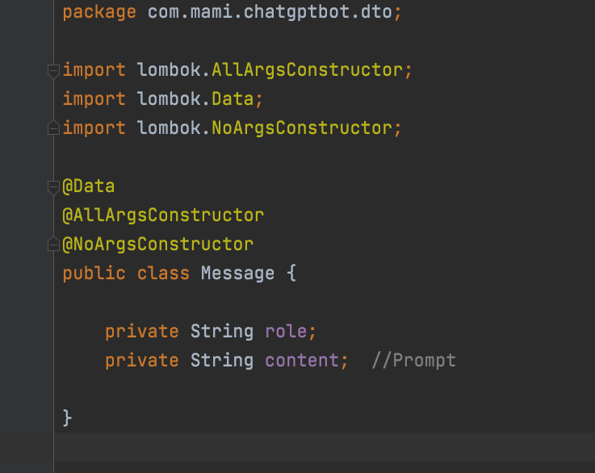

### 4 - Create Controller

Let's add some properties

```yaml
openai.model=gpt-3.5-turbo
openai.api.url=https://api.openai.com/v1/chat/completions
```

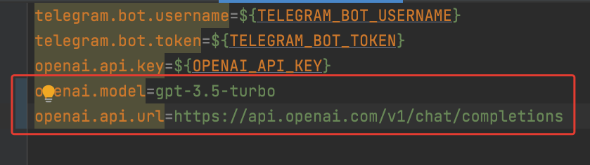

In controller package let's create a new class `CustomBotController`
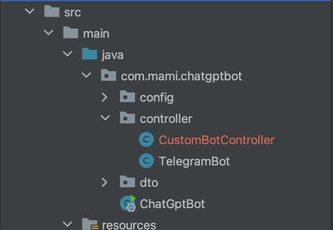

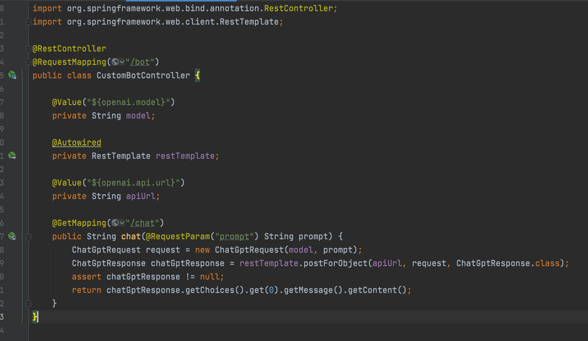

### 5 - Send request

Start the app and in PostMan send request
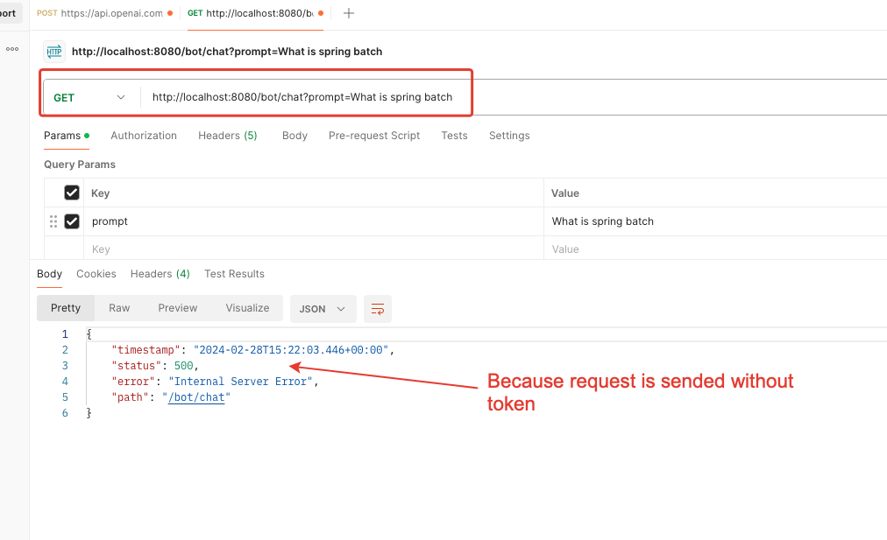
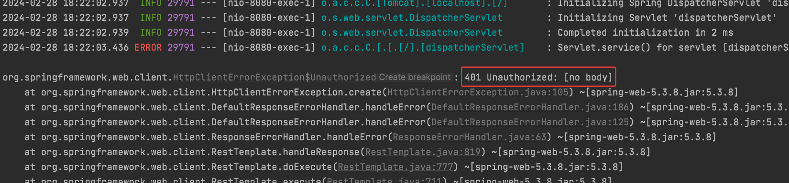

### 6 - Add token

Open the config file and make some change in bean `ResTemplate`
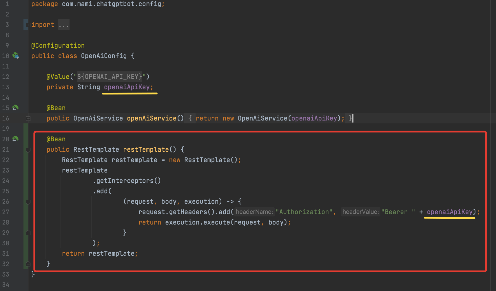

### 7 - Send request with token

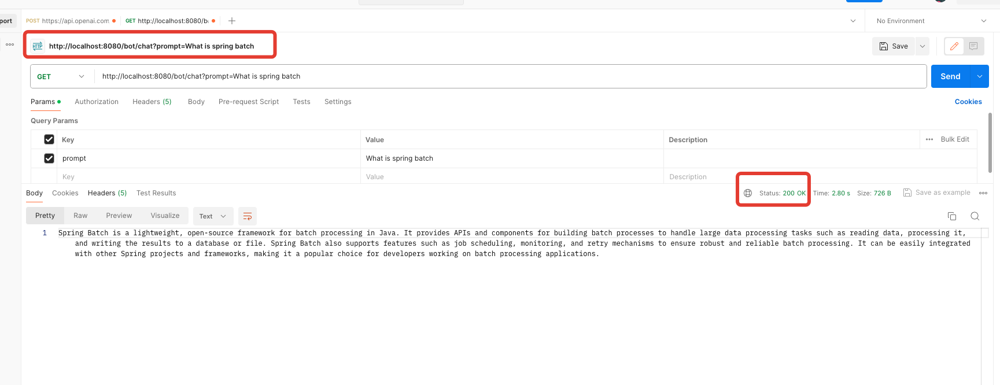

### 8 - Refactoring of TelegramBot

Inject `RestTemplate` bean.

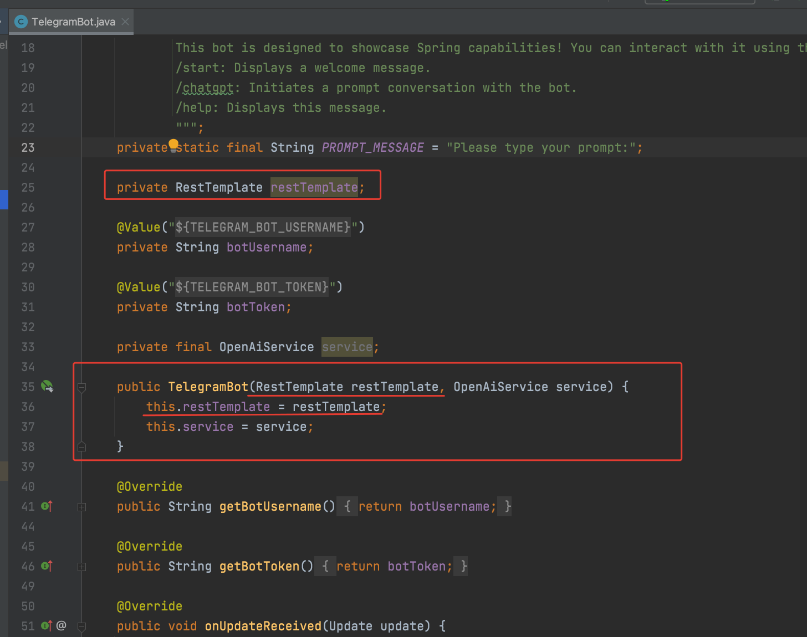


We have also to remove method `String getResponseFromChatGPT(String message)`
from TelegramBot which was written in [Version 1](https://github.com/lalik77/chat-gpt-telegram-bot-v1)


```java
private String getResponseFromChatGPT(String message){

        CompletionRequest completionRequest=CompletionRequest.builder()
        .prompt(message)
        .model("gpt-3.5-turbo-instruct")
        .echo(true)
        .build();
final String result=service.createCompletion(completionRequest)
        .getChoices()
        .get(0)
        .getText()
        .strip();
        return result;
        }
```

and refactor method `void processPromptResponse(long chatId, String question)`

```java
private void processPromptResponse(long chatId,String prompt){
        String apiUrl="http://localhost:8080/bot/chat?prompt="+prompt;
        String response=restTemplate.getForObject(apiUrl,String.class);
        sendTextMessage(chatId,response);
        }
```


